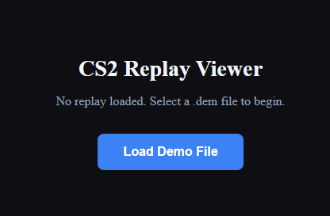
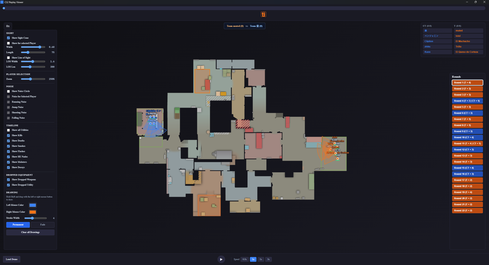
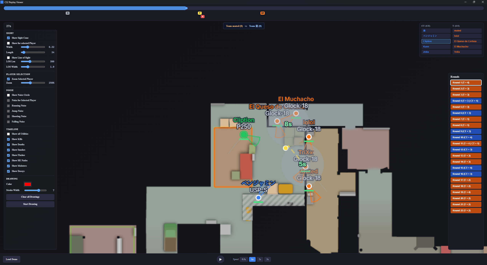
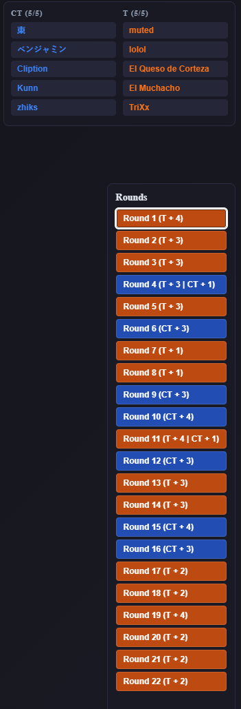
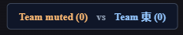

# CS2 Replay Viewer

An open-source, simple 2D viewer for Counter-Strike 2 replay demos. Load a `.dem` file to replay rounds on an interactive radar map, inspect player movement and utility, and quickly jump to the moments that matter.

## Screenshots

### Welcome screen

Start by selecting a CS2 `.dem` replay file.

### Replay workspace

The loaded-demo view combines the interactive radar, sight and noise controls, timeline filters, drawing controls, team lists, round navigation, and playback controls.

### Player focus and utility timing

Select and zoom in on a player while following utility effects and their remaining duration.

### Team and round tracking

Team colors remain consistent across the player lists and round navigator, making the winning side and surviving players easy to scan.

### Tactical drawing

Draw routes, callouts, and tactical plans directly on the map.

## Features

### Replay navigation

- Load Counter-Strike 2 `.dem` replay demos.
- Play or pause with the on-screen button or the <kbd>Space</kbd> key.
- Automatically skip knife rounds and freezetime.
- Browse a timeline for every round.
- View color-coded round results, including the winning side and surviving Terrorists and Counter-Terrorists.

### Timeline and event review

- Configure timeline visibility with timeline controls.
- Show highlighted, color-coded kill, death/headshot, utility, bomb-plant, bomb-explosion, defuse, and time-expiry SVG icons underneath a timeline that packs non-overlapping events into shared lanes and grows only when stacking is necessary.
- Click an event marker to seek to two seconds before the event.
- Double-click an event marker to copy a CS2 `demo_goto` command for two seconds before that event, ready to paste into the CS2 demo viewer.
- Use the clickable kill feed—with weapon, headshot, flash-assist, blinded-killer, airborne, no-scope, through-smoke, and wallbang SVG indicators and up to ten recent entries—to jump to kills quickly. Flash assists also identify the assisting player.
- Clearly highlight player-roster and round-navigation buttons when hovering or using keyboard focus.

### Tactical information

- Adjust responsive player sight-cone and line-of-sight overlays without redrawing the full player layer.
- Show noise circles for running, shooting, jumping, and falling.
- Review grenade and utility activity directly on the map, including smoke/fire center icons and countdowns; Molotovs and incendiaries are hard-capped at 7 seconds and disappear sooner at their actual smoke-extinguished expiry time.
- Track player health accurately, with dead players shown at zero health.

### Map interaction and drawing

- Zoom toward the current mouse position with the mouse wheel.
- Hold the left mouse button and drag to move around the zoomed map.
- Select a player dot or roster name to automatically zoom and center the player at the configured zoom level; deselecting keeps the current zoom and viewport position while stopping camera follow.
- Create simple drawings by holding <kbd>Shift</kbd> and dragging with the left mouse button; choose the color and stroke width or clear all drawings from the controls.

## Libraries and tools

- [demoinfocs-golang](https://github.com/markus-wa/demoinfocs-golang) — parses CS2 `.dem` files and provides the game events, player frames, grenade data, and round data used by the viewer.
- [Protocol Buffers](https://github.com/protocolbuffers/protobuf) — serializes the parsed replay data efficiently between the Go parser and the application.
- [protobuf-es](https://github.com/bufbuild/protobuf-es) — reads the protobuf replay data in the TypeScript frontend.
- [Tauri](https://github.com/tauri-apps/tauri) — provides the lightweight desktop application shell and native file, shell, and dialog integration.
- [Svelte](https://github.com/sveltejs/svelte) and [SvelteKit](https://github.com/sveltejs/kit) — power the interactive TypeScript user interface.
- [Vite](https://github.com/vitejs/vite) — builds and bundles the frontend.
- [cs2-map-icons](https://github.com/MurkyYT/cs2-map-icons) — supplies the radar images and overview metadata used to place replay data accurately on each supported map.
- [counter-strike-icons](https://github.com/Juknum/counter-strike-icons/tree/main/cs2/panorama/images/icons/equipment) — supplies the CS2 equipment SVGs used by the kill feed, timeline markers, and utility effect centers from `static/equipment-icons`. The empty `world.svg` and `worldent.svg` source files are intentionally excluded.

## Supported maps

- de_ancient
- de_anubis
- de_cache
- de_dust2
- de_inferno
- de_mirage
- de_nuke
- de_overpass
- de_train
- de_vertigo

## License

This project is open source. See [LICENSE](LICENSE) for details.

## Donations

If you enjoy CS2 Replay Viewer and would like to support its development, you can donate via PayPal.

