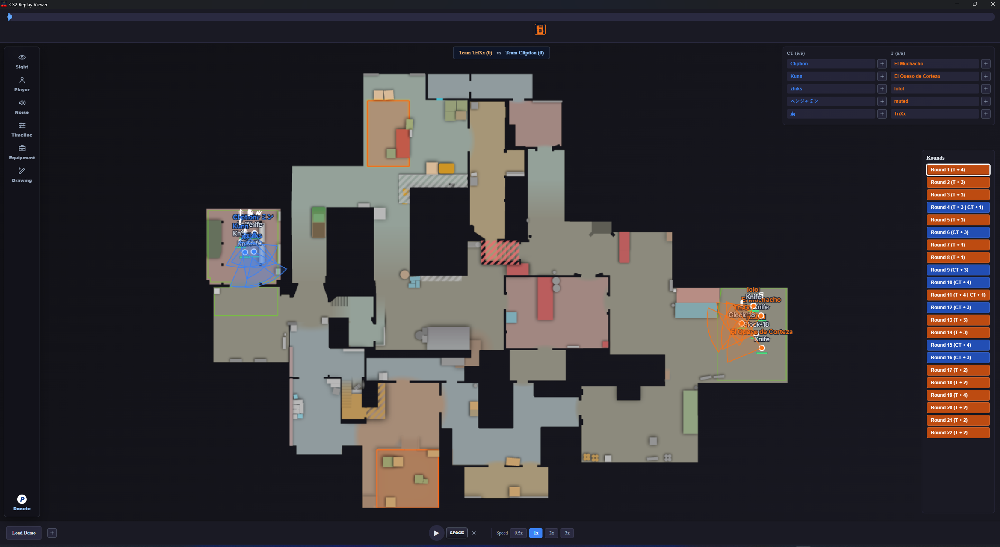
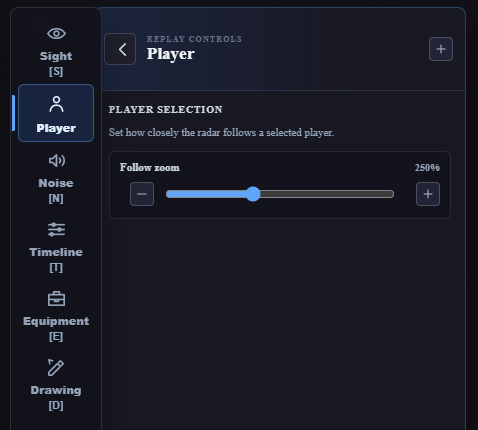
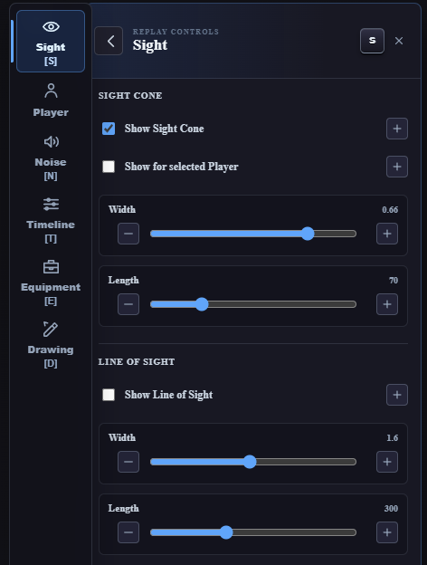
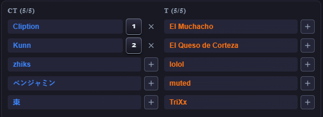
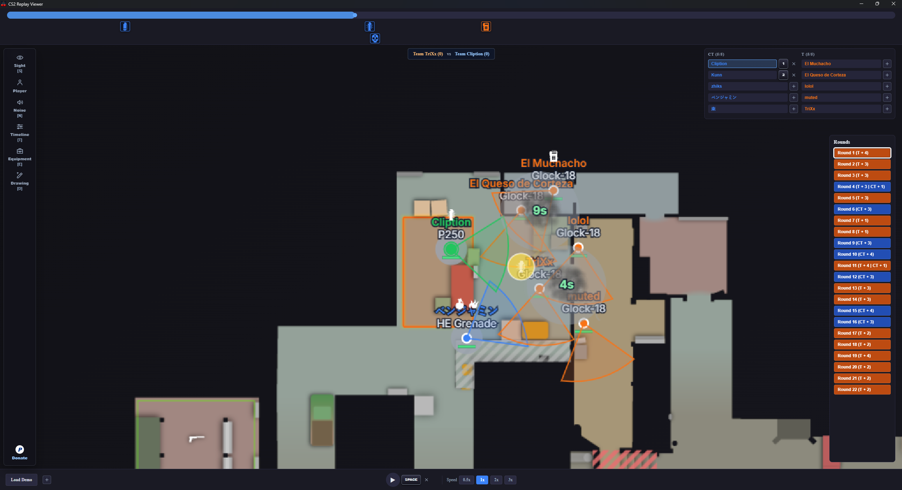
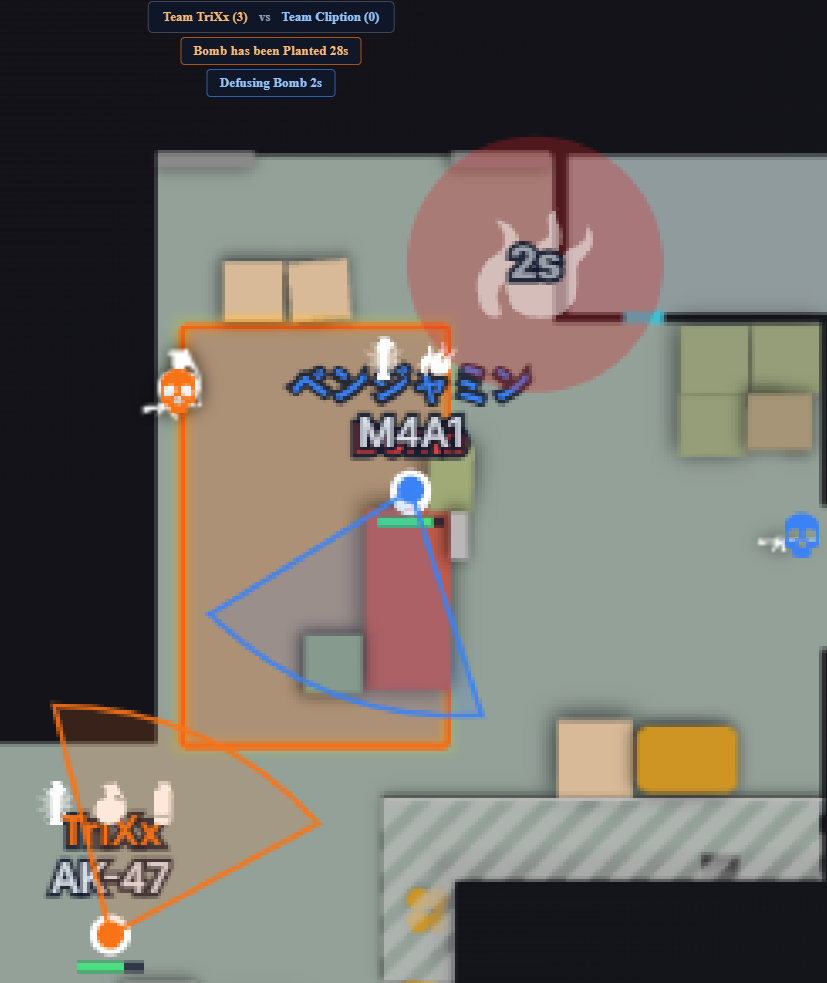
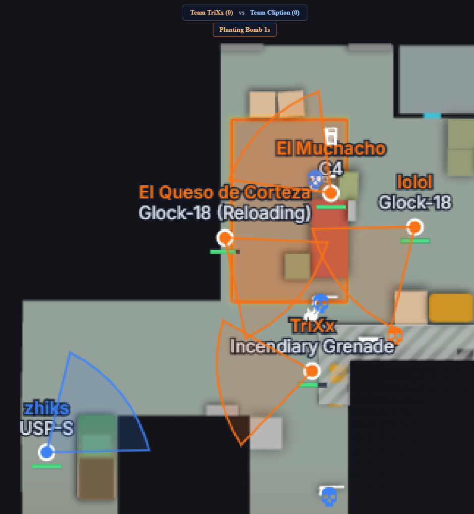
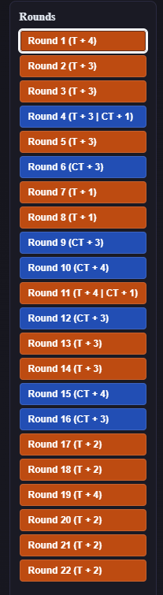
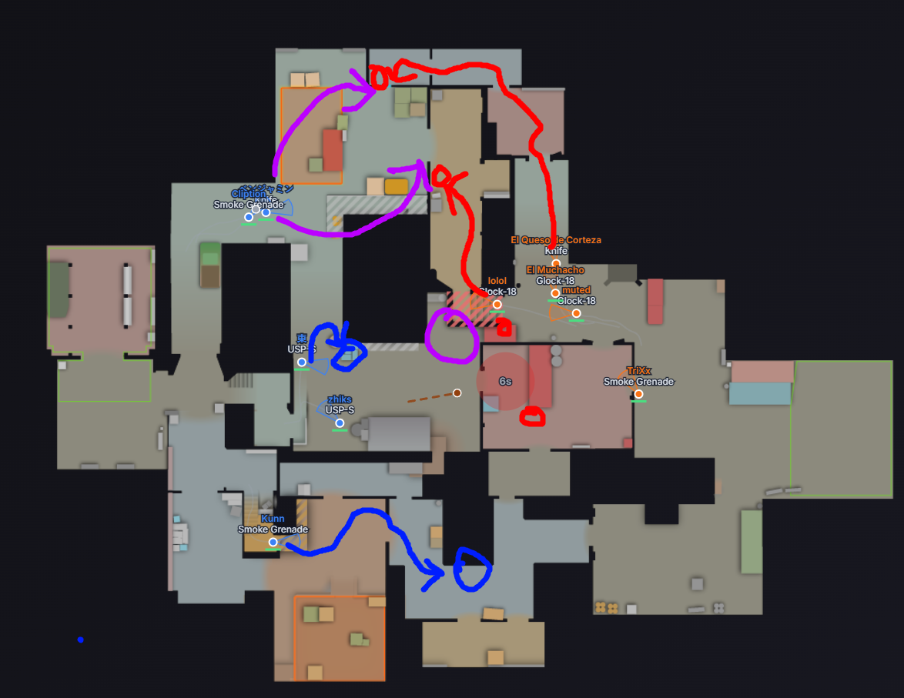

# CS2 Replay Viewer

An open-source 2D and 3D viewer for Counter-Strike 2 replay demos. Load a `.dem` file to replay rounds on an interactive radar or directly inside extracted CS2 map geometry, inspect player movement and utility, and quickly jump to the moments that matter.

## Screenshots

### Welcome screen

Start from a focused welcome screen and select a CS2 `.dem` replay file.

### Loaded replay workspace

The full replay workspace combines the interactive radar, event timeline, section toolbar, team rosters, color-coded round history, and playback controls.

### Side panels and section shortcuts

Open only the controls you need. Section shortcuts can be left unassigned or displayed directly on the toolbar and panel header after assignment.

| Without a section shortcut | With a section shortcut |
|---|---|
|  |  |

### Color-coded teams and roster shortcuts

CT and T players remain color-coded and alphabetically sorted. Shortcuts belong to roster positions, while unassigned positions show an add button.

### Player focus and utility timing

Highlight and follow a selected player while inspecting sight lines, equipment, active utility, and effect countdowns.

### Bomb plant and defuse timers

Track the remaining bomb timer and an active defuse directly above the radar while reviewing the surrounding positions.

### Dropped equipment and dead-player markers

See dropped weapons and utility alongside living-player equipment, reload status, and team-colored dead-player icons.

### Color-coded round history

Review every round at a glance with winner colors and surviving-player counts for both sides.

### Team score tracking

Keep the current score visible with team names and consistent T/CT color coding.

### Tactical drawing

Draw routes, callouts, positions, and tactical plans directly on the replay radar.

## Features

### Welcome and project support

- Open the PayPal donation page directly from the Welcome screen to support continued development.

### Replay navigation

- Load Counter-Strike 2 `.dem` replay demos.
- Play or pause with the on-screen button or the editable <kbd>Space</kbd> shortcut.
- Automatically skip knife rounds and freezetime.
- Browse a timeline for every round.
- View color-coded round results, including the winning side and surviving Terrorists and Counter-Terrorists.
- Keep CT and T player lists consistently sorted by player name in ascending order whenever a replay is loaded.

### 2D and 3D views

- Switch between the existing 2D radar and an interactive 3D map without changing the current round, timeline, playback position, or selected player.
- Select the `steamapps\common\Counter-Strike Global Offensive` installation folder once; the validated path is kept in the local settings database for later sessions, and the viewer resolves `game\csgo\maps` itself.
- Extract only the map used by the loaded replay and stream its Source 2 geometry and textures from a versioned local cache. Completed caches are reused in later sessions, while interrupted extractions are never treated as valid.
- Select players from the roster, by shortcut, or directly in the 3D scene to enter their recorded eye view.
- Move the free camera with editable, database-backed <kbd>W</kbd>, <kbd>A</kbd>, <kbd>S</kbd>, and <kbd>D</kbd> defaults. Movement speed starts at 36, and movement and mouse-wheel zoom speed remain configurable from the 3D-only Camera panel.
- Keep 3D line of sight enabled by default with a starting length of 500. Configure its real beam width from 1–50, length up to 1100, and transparency while retaining the full existing Sight panel in 2D mode.
- Follow thrown utility along its recorded per-tick 3D arc and wall/floor bounces, with box-shaped utility shown vertically, without changing the established 2D utility rendering.
- Mark the planted bomb with a small orange sphere at its planted position; the marker turns gray after a defuse and red after an explosion.
- Read an in-world explosion countdown above the planted bomb, a blue active-defuse countdown beneath it, and clear `Bomb defused` or `Bomb exploded` status text when the bomb reaches a terminal state.
- Fly the free camera directly along the current viewing direction with forward/backward movement, including upward and downward pitch.

### Toolbar and custom shortcuts

- Open Sight, Player, Noise, Timeline, Equipment, and Drawing controls from a compact icon-and-label toolbar on the left; select an open section again or use the panel's back button to close it.
- See each assigned section shortcut as readable bracketed text directly on its toolbar item, with highlighting that always follows the currently open panel.
- Open the PayPal support page directly from the toolbar's Donate item.
- Assign, edit, and remove globally unique keyboard or mouse shortcuts for section headers, checkboxes, supported buttons, playback actions, map variants, and individual roster players. Replay-speed preset buttons remain direct click controls without shortcuts.
- Give every slider an independent decrease and increase shortcut. Press once for one step or hold the shortcut to repeat at the keyboard repeat rate; values remain within their ranges. Holding non-slider shortcuts still triggers them only once.
- Use shortcuts while their control panel is closed. Player shortcuts belong to sorted CT/T roster positions rather than Steam IDs, so they stay on the same visible slot when teams switch sides and trigger the current occupant.
- Click an assigned shortcut keycap to edit it directly; use the adjacent remove icon to clear it.
- Keep shortcut assignments across sessions in the application's local database, with existing mouse-wheel zoom inputs protected from reassignment.
- Press <kbd>Escape</kbd> while adding or editing any shortcut to cancel and preserve the previous assignment.

### Timeline and event review

- Configure timeline visibility with timeline controls.
- Show highlighted, color-coded kill, death/headshot, utility, bomb-plant, bomb-explosion, defuse, and time-expiry SVG icons underneath a timeline that packs non-overlapping events into shared lanes and grows only when stacking is necessary.
- Click an event marker to seek to two seconds before the event.
- Double-click an event marker to copy a CS2 `demo_goto` command for two seconds before that event, ready to paste into the CS2 demo viewer.
- Use the clickable kill feed—with weapon, headshot, flash-assist, blinded-killer, airborne, no-scope, through-smoke, and wallbang SVG indicators and up to ten recent entries—to jump to kills quickly. Flash assists also identify the assisting player.
- Clearly highlight player-roster and round-navigation buttons when hovering or using keyboard focus.
- Click a smoke or fire effect on the map to copy its `demo_goto` command, or double-click it to select the thrower and seek to two seconds before the throw.
- Interact with compact, 50%-transparent Flashbang, HE grenade, and Decoy destination icons using single-click copy and double-click seek behavior.

### Tactical information

- Adjust responsive player sight-cone and line-of-sight overlays without redrawing the full player layer.
- Show responsive, independently filterable noise circles for running, shooting, jumping, falling, weapon drops, utility drops, C4 drops, and weapon reloads. Drop circles appear at the item's destination after it lands, including when the demo event omits weapon details.
- Review grenade and utility activity directly on the map, including smoke/fire center icons and countdowns; Molotovs and incendiaries are hard-capped at 7 seconds and disappear sooner at their actual smoke-extinguished expiry time.
- Track living-player health accurately; dead CT players use a blue death icon, dead T players use an orange death icon, and neither shows a health bar.
- See each living player's currently selected weapon or utility name, including a `(Reloading)` status for the full reload lifecycle, plus all remaining utility and carried C4 as stable icons above their name, including both carried Flashbangs when applicable.
- Show exact parser-reported dropped weapon, utility, and ownerless C4 icons through the current round's seven-second post-round window, with separate visibility checkboxes enabled by default and automatic clearing when another round is selected.

### Map interaction and drawing

- Zoom toward the current mouse position with the mouse wheel.
- While following a selected player, use the mouse wheel to adjust the Player Selection zoom value while keeping that player centered.
- Hold the left mouse button and drag to move the map at every zoom level, with generous movement beyond each edge; clicking or dragging empty canvas space exits player follow mode.
- Select a living player dot or roster name to automatically zoom and center the player at the configured zoom level. Selection clears automatically when that player dies.
- Single-click a dead-player icon to copy `demo_goto <Tick>` for three seconds before death, or double-click it to select the player and jump to that tick.
- Create tactical drawings by holding the editable keyboard-only Drawing Setup shortcut—<kbd>Shift</kbd> by default—and dragging with either mouse button. Primary and secondary colors default to CT blue and T orange.
- Keep drawings permanently for the current round or fade them over 1–6 seconds. Changing rounds and `Clear all Drawings` both remove permanent drawings.
- Keep the radar at a consistent visual size when maximizing or restoring the application while zoomed.
- Load and paint the radar background before player dots and other replay overlays appear, without flashing the coordinate grid during normal loading.
- Suppress the embedded WebView context menu so right-click interactions never open browser controls over either replay view.

## Libraries and tools

- [demoinfocs-golang](https://github.com/markus-wa/demoinfocs-golang) — parses CS2 `.dem` files and provides the game events, player frames, grenade data, and round data used by the viewer.
- [Protocol Buffers](https://github.com/protocolbuffers/protobuf) — serializes the parsed replay data efficiently between the Go parser and the application.
- [protobuf-es](https://github.com/bufbuild/protobuf-es) — reads the protobuf replay data in the TypeScript frontend.
- [Tauri](https://github.com/tauri-apps/tauri) — provides the lightweight desktop application shell and native file, shell, and dialog integration.
- [Svelte](https://github.com/sveltejs/svelte) and [SvelteKit](https://github.com/sveltejs/kit) — power the interactive TypeScript user interface.
- [Vite](https://github.com/vitejs/vite) — builds and bundles the frontend.
- [Three.js](https://threejs.org/) — renders the interactive 3D replay scene, players, utility, and extracted map geometry.
- [ValveResourceFormat](https://github.com/ValveResourceFormat/ValveResourceFormat) — extracts local CS2 map resources into the cached glTF data used by the 3D view. The pinned Windows CLI and its native runtime files are provisioned automatically during Tauri development and release builds, then bundled into the installer; end users do not install or download it separately.
- [cs2-map-icons](https://github.com/MurkyYT/cs2-map-icons) — supplies the radar images and overview metadata used to place replay data accurately on each supported map.
- [counter-strike-icons](https://github.com/Juknum/counter-strike-icons/tree/main/cs2/panorama/images/icons/equipment) — supplies the CS2 equipment SVGs used by the kill feed, timeline markers, and utility effect centers from `static/equipment-icons`. The empty `world.svg` and `worldent.svg` source files are intentionally excluded.

## Supported maps

- de_ancient
- de_anubis
- de_cache
- de_dust2
- de_inferno
- de_mirage
- de_nuke
- de_overpass
- de_train
- de_vertigo

## License

This project is open source. See [LICENSE](LICENSE) for details.

## Donations

If you enjoy CS2 Replay Viewer and would like to support its development, you can donate via PayPal.

